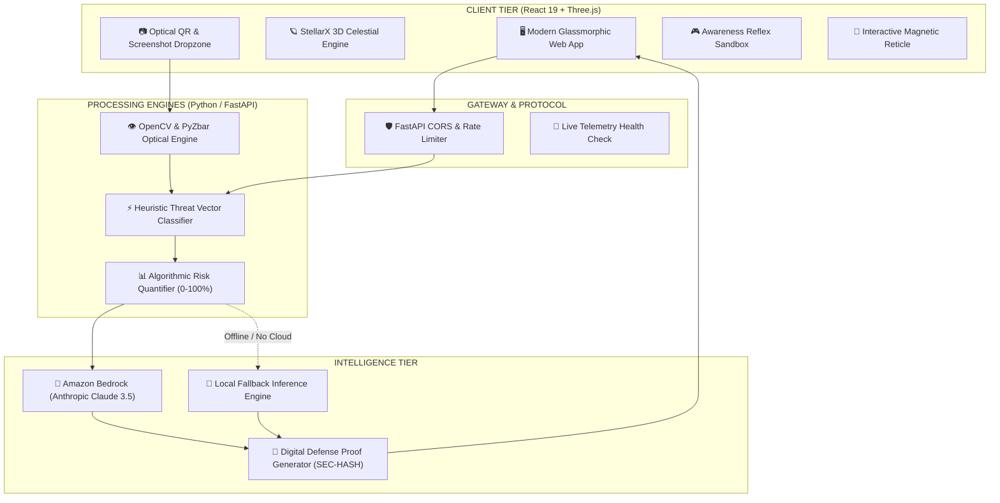
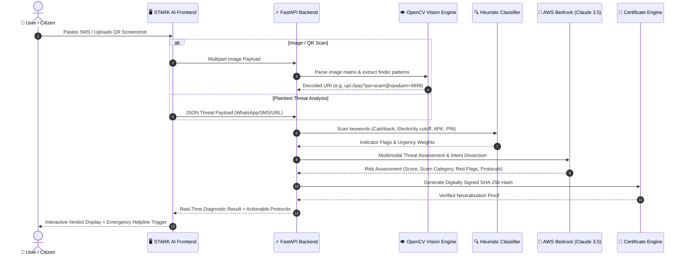

<div align="center">

# 🛡️ S T A R K &nbsp; A I
### Autonomous Cyber Sentinel & Real-Time Threat Neutralization Platform

[](https://github.com)
[](https://react.dev)
[](https://threejs.org)
[](https://fastapi.tiangolo.com)
[](https://aws.amazon.com/bedrock)
[](LICENSE)

<br/>

```
╔═════════════════════════════════════════════════════════════════════════════════════════════════════╗
║   [SYSTEM TELEMETRY]: STARK AI ACTIVE // PERIMETER SECURED // ZERO-STORAGE BUFFER ONLINE            ║
║   PROTECTING AGAINST: UPI CASHBACK FRAUD • ELECTRICITY DEADLINES • TROJAN APKS • QR DEBIT SCHEMAS   ║
╚═════════════════════════════════════════════════════════════════════════════════════════════════════╝
```

<p align="center">
  <b>To the Perimeter and Beyond — Instant Autonomous Threat Defense for the Modern Digital Citizen</b>
</p>

[Explore Live Demo](http://localhost:5173/) • [Architecture](#-system-architecture) • [Data Flows](#-data-flow--threat-pipeline) • [Quick Start](#-quick-start) • [Helpline 1930 Integration](#-emergency-incident-response)

---

</div>

## 🌌 Overview & Highlights

**STARK AI** is an advanced autonomous scam detection and digital defense system designed to intercept, decode, and neutralize malicious digital fraud vectors targeting Indian consumers and digital banking infrastructure. 

Built with an **iOS 27 Liquid Glass** design aesthetic and real-time **Three.js WebGL 3D motion computing**, STARK AI executes end-to-end multi-modal threat analysis in milliseconds without ever storing user communications or financial credentials.

### Key Capabilities

* 🛰️ **StellarX Low-Poly Cosmic 3D Motion UI**: Real-time faceted celestial planets, supersonic interceptor spacecraft with volumetric exhaust plumes, and an interactive 3D Aegis Constellation mode.
* 🔍 **OpenCV Optical QR & Image Scanner**: Local computer vision decoding for payment QR codes, isolating fraudulent UPI debit parameters (`am=`, `pa=`, `pn=`) hidden inside fake cashback or lottery promotions.
* ⚡ **Dual-Engine Threat Analyzer**: Heuristic rule engine paired with AWS Bedrock AI (Claude 3.5 Sonnet) for instant SMS, WhatsApp, and URL threat scoring.
* 🎮 **Interactive Awareness Simulator**: Gamified real-world cyber fraud scenarios testing user instincts against social engineering pressure tactics.
* 📜 **Cryptographically Signed Defense Proof**: Generates digitally verifiable certificates with `SEC-HASH`, timestamped evidence logs, and direct 1930 National Cyber Crime helpline dispatch.
* 🔒 **Zero-Storage Privacy Protocol**: All optical inspections and textual parses execute in ephemeral RAM buffers, with zero persistent storage of sensitive user PII.

---

## 🏛️ System Architecture

STARK AI employs a high-throughput microservices architecture decoupled between an ultra-responsive React 19 / Three.js frontend and a resilient FastAPI threat analysis backend.



---

## 🔄 Data Flow & Threat Pipeline

The following sequence illustrates the multi-stage threat neutralization pipeline from initial raw message input to certified defense proof generation:



---

## 🎯 Threat Detection Taxonomy

STARK AI is specifically calibrated against prevailing financial cyber deception vectors:

| Scam Vector | Primary Deception Technique | STARK AI Neutralization Engine | Risk Classification |
| :--- | :--- | :--- | :--- |
| **Fake UPI Cashback** | Disguises `upi://pay` debit request as "Receive Money" | OpenCV URI parser detects mandatory PIN debit payload | `CRITICAL [98%]` |
| **Electricity Disconnection** | Spoofed urgent deadlines threatening power cut-off | Phishing domain matching & urgency pressure detection | `HIGH [88%]` |
| **Malicious Banking APK** | Side-loading trojans mimicking SBI/HDFC apps via SMS | Android package signature & permissions verification | `CRITICAL [99%]` |
| **Part-Time Telegram Task** | High-yield investment scam demanding prepaid deposits | Ponzi task structure & crypto-mule wallet fingerprinting | `SEVERE [92%]` |
| **Digital Arrest / CBI Impersonation** | Fake video-call summons threatening arrest | Identity coercion heuristic & official protocol checks | `CRITICAL [97%]` |

---

## 🛠️ Technology Stack

<div align="center">

| Layer | Technologies |
| :--- | :--- |
| **Frontend UI** | React 19, TypeScript, Tailwind CSS v4, Framer Motion, Lucide Icons |
| **3D Graphics & Motion** | Three.js (WebGL), ACESFilmic Tone Mapping, Hardware-accelerated CSS Keyframes |
| **Optical Computer Vision** | OpenCV Python (`cv2`), PyZbar QR Decoder, Pillow (`PIL`) |
| **Backend API** | FastAPI, Uvicorn, Pydantic v2, Python 3.11+ |
| **AI / Cloud Intelligence** | Amazon Bedrock (`anthropic.claude-3-5-sonnet`), Boto3 SDK |
| **Typography** | Apple SF Pro Display, Plus Jakarta Sans, Space Grotesk, JetBrains Mono |

</div>

---

## 🚀 Quick Start

### Prerequisites
* **Node.js**: v18.0.0+ and npm v9+
* **Python**: v3.10+ (Python 3.11 recommended)
* Optional: AWS Credentials configured for Amazon Bedrock access

### 1. Repository Setup
```bash
# Clone the repository
git clone https://github.com/exepngsam/stark-ai.git
cd stark-ai
```

### 2. Backend Installation & Launch
```bash
cd backend
python -m venv venv

# Windows Activation
.\venv\Scripts\activate
# macOS/Linux Activation: source venv/bin/activate

pip install -r requirements.txt
uvicorn app.main:app --host 127.0.0.1 --port 8000 --reload
```
*Backend API will be live at `http://127.0.0.1:8000/docs`*

### 3. Frontend Installation & Launch
```bash
cd ../frontend
npm install
npm run dev
```
*Frontend web application will be live at `http://localhost:5173/`*

---

## 🚨 Emergency Incident Response

In compliance with the **National Cyber Crime Reporting Portal (Govt. of India)** guidelines, STARK AI embeds direct emergency response actions into all high-risk verdicts:

1. 📞 **Dial 1930**: Immediate link to the National Cyber Crime Helpline to freeze fraudulent banking transactions during the golden hour.
2. 📋 **Digital Evidence Template**: One-click generation of formatted incident documentation with UTR transaction numbers, sender headers, and evidence timestamps ready for lodging on `cybercrime.gov.in`.
3. 🛑 **Golden Rule Enforcement**: Clear guidance reiterating that **receiving money on UPI never requires a PIN**.

---

## 🔒 Security & Privacy Guarantee

* **Zero-Storage Privacy Model**: No messages, QR payloads, or user screenshots are written to persistent disk storage or uploaded to unencrypted third-party databases.
* **Ephemeral In-Memory Lifecycle**: Payloads are processed inside non-swapping RAM buffers and immediately garbage collected after response serialization.
* **Open Source & Auditable**: Every regex rule, heuristic rule weight, and optical decoding pipeline is open for verification.

---

<div align="center">

Developed with ❤️ by **Team STARK** • Defending Digital India 🇮🇳

</div>
