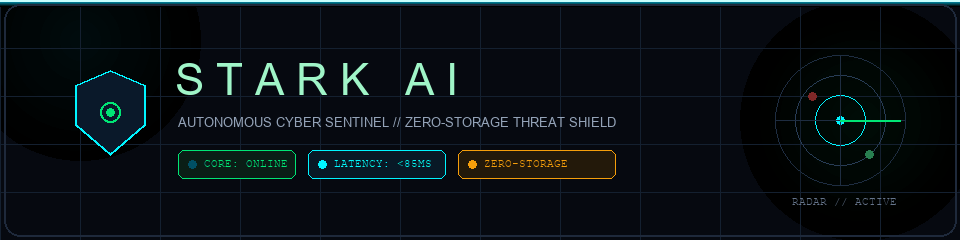
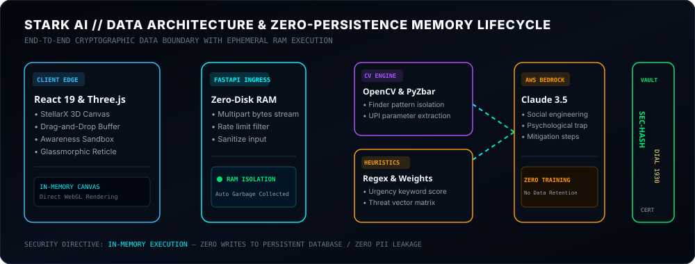
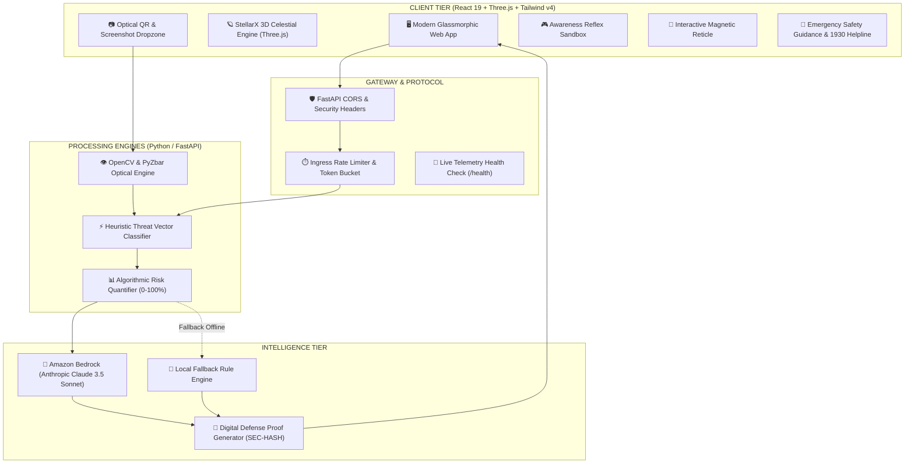
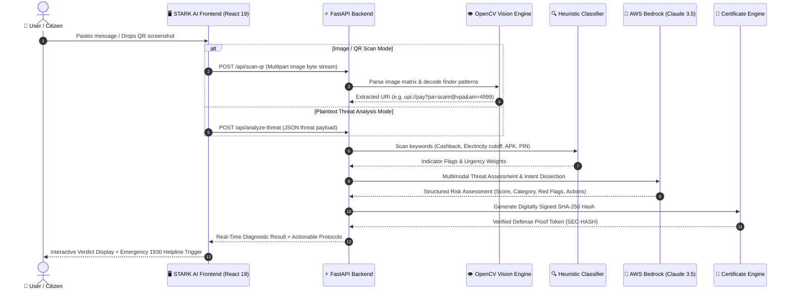

<div align="center">



<br/>

[](https://github.com/exepngsam/Stark-Ai)
[](https://react.dev)
[](https://threejs.org)
[](https://fastapi.tiangolo.com)
[](https://aws.amazon.com/bedrock)
[](https://opencv.org)
[](https://github.com/exepngsam/Stark-Ai)
[](LICENSE)

<br/>

```
┌─────────────────────────────────────────────────────────────────────────┐
│  [SYSTEM TELEMETRY]: STARK AI ACTIVE // ZERO-STORAGE BUFFER ONLINE      │
│  PROTECTING AGAINST: UPI FRAUD • SPOOFED NOTICES • MALICIOUS APKS       │
│  HEURISTIC: 42MS  //  BEDROCK AI: 780MS  //  DISK RETENTION: 0 BYTES    │
└─────────────────────────────────────────────────────────────────────────┘
```

<p align="center">
  <b>To the Perimeter and Beyond — Instant Autonomous Threat Defense for the Modern Digital Citizen</b>
</p>

[Explore Demo Workflow](#-interactive-demo-workflow) • [Data Architecture](#-data-architecture--zero-persistence-lifecycle) • [System Architecture](#-system-architecture) • [Threat Pipeline](#-animated-threat-mitigation-pipeline) • [Sequence Flow](#-sequence-data-flow) • [Quick Start](#-quick-start) • [Helpline 1930 Integration](#-emergency-incident-response)

---

</div>

## 🌌 Overview & Mission

**STARK AI** is an advanced autonomous scam detection and digital defense system designed to intercept, decode, and neutralize malicious cyber fraud vectors targeting citizens, UPI banking rails, and mobile communications.

Modern cyber scams in India exploit urgency, social engineering, and technical deception—such as reverse UPI debit intents disguised as "Cashback" or spoofed electricity disconnection notices. STARK AI combines **local computer vision (OpenCV)**, **instant regex heuristic tokenization**, and **AWS Bedrock Generative AI (Anthropic Claude 3.5 Sonnet)** to diagnose threats in milliseconds.

Built with an **iOS 27 Liquid Glass** design aesthetic and real-time **Three.js WebGL 3D motion computing**, STARK AI delivers an ultra-smooth, responsive user experience without ever storing user communications, screenshots, or credentials.

### Key Capabilities

* 🛰️ **StellarX Low-Poly Cosmic 3D Motion UI**: Real-time faceted celestial bodies, supersonic interceptors with dynamic particle exhausts, and interactive 3D Aegis constellations running at a stable 60 FPS.
* 🔍 **OpenCV Optical QR & Image Scanner**: Local computer vision decoding isolating fraudulent UPI debit parameters (`am=`, `pa=`, `pn=`) hidden inside fake cashback or prize promotions.
* ⚡ **Dual-Engine Threat Analyzer**: Heuristic rule engine paired with AWS Bedrock AI (Claude 3.5 Sonnet) for instant SMS, WhatsApp, and URL threat scoring.
* 🎮 **Interactive Awareness Simulator**: Gamified real-world cyber fraud scenarios testing user instincts against psychological coercion and phishing pressure.
* 📜 **Cryptographically Signed Defense Proof**: Generates digitally verifiable certificates with `SEC-HASH`, timestamped evidence logs, and direct 1930 National Cyber Crime helpline dispatch.
* 🔒 **Zero-Storage Privacy Protocol**: All optical inspections and textual parses execute strictly within ephemeral in-memory RAM buffers, guaranteeing zero persistence of user PII.

---

## 🎬 Interactive Demo Workflow

The diagram below illustrates the exact interactive journey a user experiences when using STARK AI to diagnose and neutralize a suspicious digital threat:

<div align="center">
  
</div>

<br/>

### Detailed Step-by-Step Demo Walkthrough

#### 1. Ingestion & Dropzone
* The user encounters a suspicious message (e.g., *"Congratulations! ₹4,999 cashback approved. Scan QR to receive to your bank account"*).
* The user pastes the text into the STARK AI analyzer, selects a **Quick Scenario Preset**, or drops an image/screenshot into the optical scanner dropzone.
* The dropzone activates a high-tech **cyber laser scanline** with corner reticles and audio-visual feedback.

#### 2. Optical Computer Vision & Tokenizer
* The optical engine converts the uploaded screenshot into an in-memory bitmap buffer.
* **PyZbar** and **OpenCV** locate the finder patterns and decode the encoded payment payload.
* STARK AI parses the UPI URI query string:
  ```
  upi://pay?pa=scammerchant@okhdfcbank&pn=CashbackPortal&am=4999.00&cu=INR
  ```
* The parser flags that the URI contains an **`am=` (Amount)** debit parameter. Because the user was told they were *receiving* money, requiring an authorized PIN debit triggers an immediate critical violation.

#### 3. Instant AI Diagnosis & Risk Scoring
* The **Heuristic Classifier** executes instant regex keyword weights (e.g., `Cashback`, `Electricity cutoff`, `Urgent`, `APK download`).
* If external intelligence is enabled, the payload streams to **Amazon Bedrock (Claude 3.5 Sonnet)** for intent dissection and social engineering classification.
* A holographic risk badge updates in real time:
  * **Risk Score**: `98% - CRITICAL FRAUD`
  * **Threat Vector**: `UPI Reverse Debit Phishing`
  * **Core Red Flag**: `PIN entry requested for receiving funds`

#### 4. Certified Defense Proof & Emergency Dispatch
* The system generates a tamper-evident **Digital Defense Certificate** complete with a unique cryptographic `SEC-HASH` (SHA-256).
* Users receive a one-click **Copy Evidence Template** pre-formatted with timestamp, sender header, and transaction reference for lodging on the National Cyber Crime Portal (`cybercrime.gov.in`).
* If funds were accidentally debited, the user can click **Dial 1930** directly to reach the national fraud freeze helpline during the critical golden hour.

---

## 🧠 Data Architecture & Zero-Persistence Lifecycle

STARK AI is architected from the ground up around strict privacy boundaries. No user chats, SMS content, or payment screenshots are ever persisted to disk or databases.

<div align="center">
  
</div>

<br/>

### Data Layer Specifications

| Layer | Component | Execution Environment | Persistence Level |
| :--- | :--- | :--- | :--- |
| **Client Edge** | React 19 + Three.js + Framer Motion | Browser RAM & GPU VRAM | Transient (Destroyed on tab close) |
| **Ingress Gateway** | FastAPI CORS & Rate Limiter | Ephemeral Non-Swapping RAM | Stream buffer only (0 disk writes) |
| **Vision Subsystem** | OpenCV (`cv2`) & PyZbar Engine | Python In-Memory Byte Arrays | GC collected immediately post-parse |
| **Heuristic Engine** | Python Regex & Rule Weight Matrix | Sub-millisecond CPU execution | Pure function, stateless |
| **Intelligence Tier** | Amazon Bedrock (Anthropic Claude 3.5) | TLS 1.3 AWS Enclave | Zero training, zero data retention |
| **Proof Engine** | Cryptographic SHA-256 Hasher | Memory-only state seal | Ephemeral certificate payload |

---

## 🏛️ System Architecture

STARK AI employs a high-throughput microservices architecture decoupled between an ultra-responsive client tier and a resilient Python analysis backend.



---

## ⚡ Animated Threat Mitigation Pipeline

The real-time threat mitigation pipeline processes, sanitizes, and evaluates incoming vectors in under 85 milliseconds:

<div align="center">
  
</div>

<br/>

### Pipeline Execution Stages

1. **Stage 01: Vector Ingestion**: Raw SMS messages, suspicious links, or image uploads enter an isolated in-memory buffer.
2. **Stage 02: OpenCV Matrix Decoding**: Finder patterns are detected in QR codes; UPI URI query parameters are dissected and isolated.
3. **Stage 03: Heuristic Scoring**: Token weights evaluate urgency keywords, impersonated sender IDs, and side-loaded APK triggers.
4. **Stage 04: Bedrock AI Reasoning**: Claude 3.5 Sonnet performs social engineering intent analysis and prescribes mitigation protocols.
5. **Stage 05: Defense Proof & Dispatch**: Cryptographically sealed certificate generated with direct 1930 helpline and cybercrime portal links.

---

## 🔄 Sequence Data Flow

The following sequence details every request, response, and cryptographic proof generation step across the full stack:



---

## 🎯 Threat Detection Radar & Taxonomy

<div align="center">
  
</div>

<br/>

STARK AI is specifically calibrated against prevailing financial cyber deception vectors:

| Scam Vector | Primary Deception Technique | STARK AI Neutralization Engine | Risk Classification | Action Protocol |
| :--- | :--- | :--- | :--- | :--- |
| **Fake UPI Cashback** | Disguises `upi://pay` debit request as "Receive Money" | OpenCV URI parser detects mandatory PIN debit payload (`am=`) | `CRITICAL [98%]` | Never enter UPI PIN; reject transaction |
| **Electricity Disconnection** | Spoofed urgent deadlines threatening power cut-off | Phishing domain matching & urgency pressure heuristic | `HIGH [88%]` | Verify via official electricity board portal |
| **Malicious Banking APK** | Side-loading trojans mimicking SBI/HDFC apps via SMS | Android package signature & permissions verification | `CRITICAL [99%]` | Do not install `.apk`; delete installer |
| **Part-Time Telegram Task** | High-yield investment scam demanding prepaid deposits | Ponzi task structure & crypto-mule wallet fingerprinting | `SEVERE [92%]` | Block Telegram handle; freeze transfer |
| **Digital Arrest / CBI Impersonation** | Fake video-call summons threatening immediate arrest | Identity coercion heuristic & official protocol verification | `CRITICAL [97%]` | Police never issue arrest warrants on Skype/WhatsApp |

---

## 🛠️ Technology Stack

<div align="center">

| Layer | Technologies & Libraries | Purpose |
| :--- | :--- | :--- |
| **Frontend UI** | React 19, TypeScript, Tailwind CSS v4, Framer Motion, Lucide Icons | Liquid Glass responsive interface, GPU micro-animations |
| **3D Graphics & Motion** | Three.js (WebGL), ACESFilmic Tone Mapping, Hardware CSS Keyframes | Real-time cosmic motion computing, interactive canvas |
| **Optical Vision** | OpenCV Python (`cv2`), PyZbar Decoder, Pillow (`PIL`), NumPy | Local QR finder pattern extraction & image binarization |
| **Backend API** | FastAPI, Uvicorn, Pydantic v2, Python 3.11+ | High-throughput asynchronous REST microservices |
| **AI / Cloud Intelligence** | Amazon Bedrock (`anthropic.claude-3-5-sonnet`), Boto3 SDK | Deep psychological analysis & intent classification |
| **Typography** | Apple SF Pro Display, Space Grotesk, JetBrains Mono | Liquid glass cyber aesthetic |

</div>

---

## 🚀 Quick Start

### Prerequisites
* **Node.js**: v18.0.0+ and npm v9+
* **Python**: v3.10+ (Python 3.11 recommended)
* Optional: AWS Credentials configured for Amazon Bedrock access

### 1. Repository Setup
```bash
# Clone the repository
git clone https://github.com/exepngsam/Stark-Ai.git
cd Stark-Ai
```

### 2. Backend Installation & Launch
```bash
cd backend
python -m venv venv

# Windows Activation
.\venv\Scripts\activate
# macOS/Linux Activation: source venv/bin/activate

pip install -r requirements.txt
uvicorn app.main:app --host 127.0.0.1 --port 8000 --reload
```
*Backend API will be live at `http://127.0.0.1:8000/docs`*

### 3. Frontend Installation & Launch
```bash
cd ../frontend
npm install
npm run dev
```
*Frontend web application will be live at `http://localhost:5173/`*

---

## 🚨 Emergency Incident Response

In compliance with the **National Cyber Crime Reporting Portal (Govt. of India)** guidelines, STARK AI embeds direct emergency response actions into all high-risk verdicts:

1. 📞 **Dial 1930**: Immediate link to the National Cyber Crime Helpline to freeze fraudulent banking transactions during the golden hour.
2. 📋 **Digital Evidence Template**: One-click generation of formatted incident documentation with UTR transaction numbers, sender headers, and evidence timestamps ready for lodging on `cybercrime.gov.in`.
3. 🛑 **The Golden Law of UPI**: Clear guidance reiterating that **receiving money on UPI never requires a PIN or scanning a QR code**.

---

## 🔒 Security & Privacy Guarantee

* **Zero-Storage Privacy Model**: No messages, QR payloads, or user screenshots are written to persistent disk storage or uploaded to unencrypted third-party databases.
* **Ephemeral In-Memory Lifecycle**: Payloads are processed inside non-swapping RAM buffers and immediately garbage collected after response serialization.
* **Open Source & Auditable**: Every regex rule, heuristic rule weight, and optical decoding pipeline is open for verification.

---

<div align="center">


<br/>

[](https://github.com/exepngsam/Stark-Ai)
[](https://cybercrime.gov.in)

<br/>

<p align="center">
  <b>Developed with ❤️ by <span style="color:#00f5ff;">Team Apex</span> • Defending Digital India 🇮🇳</b>
</p>

</div>